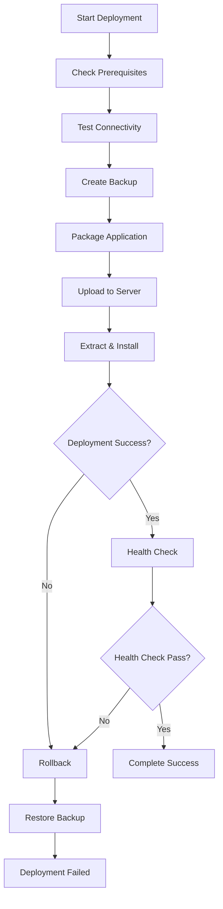

# 🚀 Enhanced Laravel Deployment Script

A comprehensive, production-ready deployment automation script for Laravel applications with rollback capabilities, health monitoring, and robust error handling.

## 📋 Table of Contents

- [What is This?](#what-is-this)
- [Features](#features)
- [Prerequisites](#prerequisites)
- [Installation](#installation)
- [Configuration](#configuration)
- [How to Use](#how-to-use)
- [How It Works](#how-it-works)
- [Pre-Deployment Checklist](#pre-deployment-checklist)
- [Post-Deployment Verification](#post-deployment-verification)
- [Troubleshooting](#troubleshooting)
- [Logs and Monitoring](#logs-and-monitoring)
- [Rollback Process](#rollback-process)
- [Future Enhancements](#future-enhancements)
- [Contributing](#contributing)
- [License](#license)

## What is This?

This is an **enterprise-grade deployment automation script** designed specifically for Laravel applications. It automates the entire deployment process from local development to production servers with built-in safety mechanisms, comprehensive error handling, and automatic rollback capabilities.

### 🎯 **Perfect for:**
- Production Laravel applications
- Teams requiring reliable deployment processes
- DevOps workflows requiring rollback capabilities
- Applications needing health monitoring
- Environments where deployment failures must be handled gracefully

## Features

### ✨ **Core Features**
- 📦 **Automated Packaging**: Creates optimized tar.gz archives
- 🚀 **Secure Upload**: Uses SCP with SSH key authentication
- 🔄 **Automatic Rollback**: Reverts to previous version on failure
- 📊 **Health Monitoring**: Comprehensive system and application health checks
- 📝 **Advanced Logging**: Detailed logs with timestamps and error tracking
- 🛡️ **Error Handling**: Handles connectivity, permission, and system issues
- ⚡ **Service Management**: Automatic PHP-FPM, Nginx, and queue worker restarts

### 🔧 **Technical Features**
- **Zero Downtime**: Backup and restore mechanism
- **Dependency Management**: Composer and NPM integration
- **Cache Optimization**: Laravel cache clearing and rebuilding
- **Permission Management**: Automatic file permission setup
- **Database Migrations**: Safe migration execution with rollback
- **Asset Building**: Frontend asset compilation (Vite/Mix support)
- **Queue Workers**: Supervisor integration for background jobs

## Prerequisites

### 🖥️ **Local Environment**
```bash
# Required commands
- bash (4.0+)
- ssh
- scp  
- tar
- php (8.0+)
- composer
```

### 🌐 **Remote Server**
```bash
# Required services
- SSH server with key-based authentication
- PHP (8.0+) with required extensions
- Composer
- Nginx or Apache
- MySQL/PostgreSQL (optional)
- Node.js (if using frontend assets)
- Supervisor (optional, for queue workers)
```

### 📁 **Laravel Project**
- Valid Laravel project structure
- `artisan` file present
- `.env.example` file (recommended)
- Proper Git repository setup

## Installation

### 1. Download the Script
```bash
# Clone this repository
git clone https://github.com/wsmr/Script-Bash-laravel-server-deployment.git
cd Script-Bash-laravel-server-deployment

# Or download directly
wget https://raw.githubusercontent.com/wsmr/Script-Bash-laravel-server-deployment/main/laravel_deploy.sh
chmod +x laravel_deploy.sh
```

### 2. Setup SSH Access
```bash
# Generate SSH key if you don't have one
ssh-keygen -t rsa -b 4096 -C "your_email@example.com"

# Copy public key to server
ssh-copy-id -i ~/.ssh/id_rsa.pub user@your-server.com

# Test SSH connection
ssh -i ~/.ssh/id_rsa user@your-server.com
```

### 3. Server Preparation
```bash
# On your server, ensure proper directory structure
sudo mkdir -p /var/www/your-domain.com
sudo chown $USER:www-data /var/www/your-domain.com
sudo chmod 755 /var/www/your-domain.com

# Create log directory
sudo mkdir -p /var/log/laravel-deploy
sudo chown $USER:$USER /var/log/laravel-deploy
```

## Configuration

### 📝 **Edit the Script Configuration**

Open `laravel_deploy.sh` and modify the configuration section:

```bash
# ==== CONFIGURATION =================================================#
PROJECT_DIR="/path/to/your/laravel/project"     # ✏️ CHANGE THIS
SSH_KEY="/home/user/.ssh/id_rsa"                # ✏️ CHANGE THIS  
SERVER_USER="ubuntu"                            # ✏️ CHANGE THIS
SERVER_IP="your.server.ip.address"             # ✏️ CHANGE THIS
REMOTE_BASE="/var/www/your-domain.com"          # ✏️ CHANGE THIS
PHP_FPM_SERVICE="php8.1-fpm"                   # ✏️ ADJUST VERSION
NGINX_SERVICE="nginx"                           # ✏️ OR "apache2"
SUPERVISOR_GROUP="laravel-worker:*"             # ✏️ IF USING QUEUES

# Optional Settings
BACKUP_RETENTION=5                              # Number of backups to keep
HEALTH_CHECK_URL="http://localhost"             # Your app URL
HEALTH_CHECK_PATH="/health"                     # Health endpoint (optional)
DB_CONNECTION_TEST="true"                       # Test database connection
# =======================================================================
```

### 🔧 **Required Changes Checklist**

- [ ] `PROJECT_DIR` - Path to your local Laravel project
- [ ] `SSH_KEY` - Path to your SSH private key
- [ ] `SERVER_USER` - Your server SSH username
- [ ] `SERVER_IP` - Your server IP address or domain
- [ ] `REMOTE_BASE` - Where Laravel will be deployed on server
- [ ] `PHP_FPM_SERVICE` - Your PHP-FPM service name
- [ ] `NGINX_SERVICE` - Your web server service name

## How to Use

### 🚀 **Basic Deployment**
```bash
# Make script executable
chmod +x laravel_deploy.sh

# Run deployment
./laravel_deploy.sh
```

### 📊 **Understanding the Output**
The script provides colored output for easy monitoring:
- 🔵 **BLUE**: Information messages
- 🟢 **GREEN**: Success messages  
- 🟡 **YELLOW**: Warning messages
- 🔴 **RED**: Error messages
- 🟣 **PURPLE**: Debug information
- 🔵 **CYAN**: Health check results

### 📝 **Example Output**
```
================================================
🚀 Enhanced Laravel Deployment v2.0
================================================
Deployment ID: 20241223-143052
Log file: ./deployment-logs/deploy-20241223-143052.log
================================================
[INFO]    Checking prerequisites...
[SUCCESS] Prerequisites check passed
[INFO]    Testing server connectivity...
[SUCCESS] Server connectivity test passed
[INFO]    Creating backup of current deployment...
[SUCCESS] Backup created successfully
```

## How It Works

### 🔄 **Deployment Flow**



### 📦 **Detailed Process**

1. **Pre-flight Checks**
   - Validate local environment
   - Test SSH connectivity
   - Verify Laravel project structure

2. **Backup Creation**
   - Create timestamped backup
   - Store current deployment safely
   - Clean old backups

3. **Package & Upload**
   - Create optimized tar.gz archive
   - Exclude unnecessary files (vendor, node_modules, .git)
   - Secure upload via SCP

4. **Remote Deployment**
   - Extract application files
   - Install Composer dependencies
   - Run database migrations
   - Build frontend assets
   - Configure caches
   - Set file permissions
   - Restart services

5. **Health Verification**
   - Test application endpoints
   - Verify service status
   - Check system resources
   - Validate database connectivity

6. **Rollback (if needed)**
   - Restore from backup
   - Restart services
   - Verify restoration

## Pre-Deployment Checklist

### 🧪 **Local Development**
- [ ] All changes committed to Git
- [ ] Laravel project tests passing
- [ ] Environment variables configured
- [ ] Database migrations tested
- [ ] Frontend assets buildable

### 🌐 **Server Environment**  
- [ ] SSH access configured and tested
- [ ] Required services installed and running
- [ ] Database accessible and backed up
- [ ] Web server configuration updated
- [ ] SSL certificates valid (if applicable)
- [ ] Domain/DNS pointing to server

### 🔐 **Security**
- [ ] SSH keys secured and backed up
- [ ] Server firewall configured
- [ ] Database credentials secured
- [ ] File permissions reviewed
- [ ] Backup strategy in place

## Post-Deployment Verification

### ✅ **Automatic Checks**
The script automatically performs these verifications:
- Application endpoint response
- Service status confirmation  
- Database connectivity test
- File permission validation
- System resource monitoring

### 🔍 **Manual Verification**
After deployment, manually verify:

```bash
# Check application status
curl -I http://your-domain.com

# Verify Laravel is working
ssh user@server "cd /var/www/your-domain.com && php artisan --version"

# Check logs for errors
ssh user@server "tail -f /var/www/your-domain.com/storage/logs/laravel.log"

# Verify database connectivity
ssh user@server "cd /var/www/your-domain.com && php artisan migrate:status"
```

## Troubleshooting

### 🐛 **Common Issues**

#### **SSH Connection Failed**
```bash
# Error: Permission denied (publickey)
# Solution: Check SSH key and server access
ssh -i /path/to/key -v user@server  # Verbose mode for debugging
```

#### **Archive Creation Failed**
```bash
# Error: tar command failed
# Solution: Check project directory path and permissions
ls -la /path/to/laravel/project
```

#### **Composer Install Failed**
```bash
# Error: Composer dependencies installation failed
# Solution: Check PHP version and extensions on server
ssh user@server "php -v && php -m"
```

#### **Permission Errors**
```bash
# Error: Cannot write to storage directory
# Solution: Fix file permissions
ssh user@server "sudo chown -R www-data:www-data /var/www/your-domain.com"
```

#### **Service Restart Failed**
```bash
# Error: PHP-FPM or Nginx restart failed
# Solution: Check service configuration
ssh user@server "sudo systemctl status php8.1-fpm nginx"
```

### 🔧 **Debug Mode**
For detailed debugging, check the log files:
```bash
# Local logs
tail -f ./deployment-logs/deploy-YYYYMMDD-HHMMSS.log

# Remote logs (if uploaded)
ssh user@server "tail -f /var/log/laravel-deploy/deploy-YYYYMMDD-HHMMSS.log"
```

## Logs and Monitoring

### 📊 **Log Locations**
- **Local**: `./deployment-logs/deploy-TIMESTAMP.log`
- **Remote**: `/var/log/laravel-deploy/deploy-TIMESTAMP.log`
- **Laravel App**: `/var/www/your-domain.com/storage/logs/laravel.log`

### 📈 **Health Report Includes**
- System information (OS, kernel, uptime)
- CPU and memory usage
- Disk space availability
- Network interface status
- Critical service status
- PHP version and extensions
- Laravel application status
- Database connectivity
- Recent log activity
- Running processes

### 🔍 **Monitoring Integration**
The script can be integrated with monitoring tools:
```bash
# Add to cron for regular health checks
0 */6 * * * /path/to/laravel_deploy.sh --health-only

# Integration with monitoring systems
# Parse log files with tools like ELK stack, Grafana, etc.
```

## Rollback Process

### 🔄 **Automatic Rollback**
Rollback is triggered automatically when:
- Remote deployment commands fail
- Application health check fails
- Service restart fails
- Database migration fails

### 🔧 **Manual Rollback**
If needed, you can manually rollback:
```bash
# SSH to server
ssh user@server

# Find backup directory
ls -la /tmp/laravel-backup-*

# Manual restore (replace TIMESTAMP)
sudo systemctl stop php8.1-fpm nginx
rm -rf /var/www/your-domain.com
cp -r /tmp/laravel-backup-TIMESTAMP/current /var/www/your-domain.com
sudo chown -R www-data:www-data /var/www/your-domain.com
sudo systemctl start php8.1-fpm nginx
```

### 📋 **Rollback Verification**
After rollback, the script automatically:
- Restores file permissions
- Restarts all services
- Verifies service status
- Tests application endpoints

## Future Enhancements

### 🚀 **Planned Features**

#### **Version 3.0 Roadmap**
- [ ] **Multi-server deployment** (load balancers, clusters)
- [ ] **Blue-green deployment** strategy
- [ ] **Docker container** support
- [ ] **Kubernetes** integration
- [ ] **Slack/Discord** notifications
- [ ] **Webhook** integration for CI/CD
- [ ] **Database backup** before migrations
- [ ] **Performance benchmarking** pre/post deployment

#### **Monitoring Enhancements**
- [ ] **Prometheus metrics** export
- [ ] **Grafana dashboard** templates
- [ ] **Email alerts** on failure
- [ ] **SMS notifications** for critical issues
- [ ] **Real-time monitoring** dashboard

#### **Security Improvements**
- [ ] **Vault integration** for secrets management
- [ ] **2FA support** for deployments
- [ ] **Audit logging** for compliance
- [ ] **Encrypted backups**
- [ ] **Security scanning** integration

#### **Developer Experience**
- [ ] **GitHub Actions** integration
- [ ] **GitLab CI/CD** templates
- [ ] **Interactive deployment** wizard
- [ ] **Configuration validation** tool
- [ ] **Deployment preview** mode

### 🔧 **Configuration Enhancements**
- [ ] **YAML/JSON configuration** files
- [ ] **Environment-specific** configurations
- [ ] **Template-based** deployments
- [ ] **Plugin system** for custom steps

### ⚡ **Performance Optimizations**
- [ ] **Parallel deployment** steps
- [ ] **Incremental backups**
- [ ] **Delta deployments** (only changed files)
- [ ] **CDN cache** invalidation
- [ ] **Database connection** pooling

## Contributing

We welcome contributions! Here's how you can help:

### 🤝 **How to Contribute**

1. **Fork** the repository
2. **Create** a feature branch (`git checkout -b feature/amazing-feature`)
3. **Commit** your changes (`git commit -m 'Add amazing feature'`)
4. **Push** to the branch (`git push origin feature/amazing-feature`)
5. **Open** a Pull Request

### 📋 **Contribution Guidelines**

- Follow existing code style and conventions
- Add tests for new features
- Update documentation for changes
- Ensure backward compatibility
- Add proper error handling
- Include logging for new features

### 🐛 **Reporting Issues**

When reporting issues, please include:
- **Operating system** and version
- **PHP version** and extensions
- **Laravel version**
- **Complete error messages**
- **Steps to reproduce**
- **Log file contents** (if applicable)

### 💡 **Feature Requests**

For feature requests, please provide:
- **Use case description**
- **Expected behavior**
- **Current workaround** (if any)
- **Implementation suggestions**

## License

This project is licensed under the MIT License - see the [LICENSE](LICENSE) file for details.

## Support

### 📞 **Getting Help**

- **GitHub Issues**: For bugs and feature requests
- **Discussions**: For questions and community support
- **Wiki**: For detailed documentation and examples

### ⭐ **Show Your Support**

If this script helped you, please consider:
- Giving it a **star** ⭐ on GitHub
- **Sharing** it with your team
- **Contributing** improvements
- **Writing** about your experience

---

## 📚 Quick Reference

### **Essential Commands**
```bash
# Basic deployment
./laravel_deploy.sh

# Check configuration
head -30 laravel_deploy.sh

# View logs
tail -f ./deployment-logs/deploy-*.log

# Test SSH connection
ssh -i /path/to/key user@server

# Manual health check
ssh user@server "systemctl status php8.1-fpm nginx"
```

### **Emergency Procedures**
```bash
# Emergency rollback
ssh user@server
sudo systemctl stop php8.1-fpm nginx
# Restore from backup (see Rollback Process section)

# Check service logs
ssh user@server "journalctl -u php8.1-fpm -f"
ssh user@server "journalctl -u nginx -f"
```

---

**Made with ❤️ for the Laravel community**

*Happy Deploying! 🚀*
